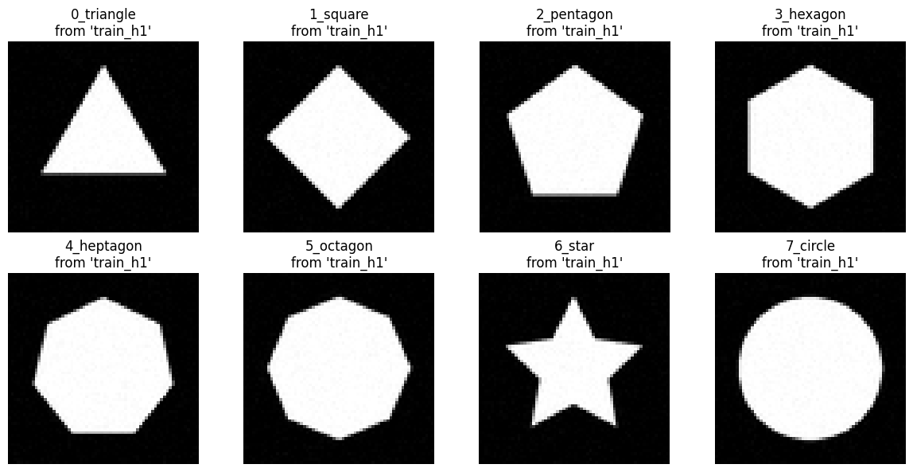
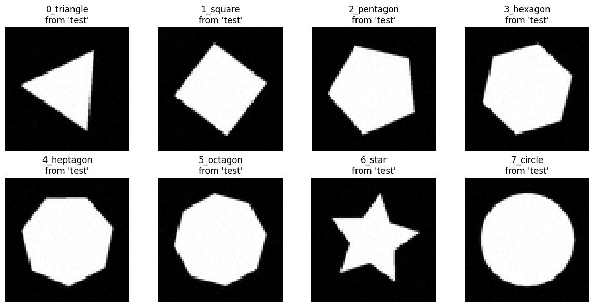

# Rotation equivariance benchmark beyond R-MNIST: PolyShape-2D

Reference paper: [Learning Steerable Filters for Rotation Equivariant CNNs](https://arxiv.org/abs/1711.07289) [^sfcnn]

The "Learning Steerable Filters for Rotation Equivariant CNNs" (SFCNN) paper proposes that building rotation equivariance into a network's architecture improves performance on rotationally variant tasks. Equivariance is the property where a transformation of a model's input leads to a corresponding, predictable transformation of its output. For SFCNNs, this design principle has two coupled consequences: rotational generalization and sample efficiency. A model that can generalize across orientations will naturally be more efficient with data, as it avoids learning redundant filters for each orientation [^sfcnn].

## Central falsifiable hypotheses of SFCNN paper

Based on the claims made in [^sfcnn], we can formulate two primary, falsifiable hypotheses that will form the basis of our experimental validation.

**H1 (rotational generalization)**: An SFCNN, when trained on data with a limited set of object orientations, will generalize its predictions to novel, unseen orientations with significantly higher accuracy than a standard CNN of comparable size and complexity. This hypothesis directly tests the central claim of equivariance-by-design. If the architecture truly understands rotation, it should not be confined to the specific orientations present in the training set [^sfcnn].

**H2 (sample efficiency)**: An SFCNN will achieve a target level of accuracy on a rotationally variant task using substantially fewer unique training samples (or fewer orientations per sample) than a standard CNN. This hypothesis follows directly from the principle of rotational weight sharing. By not needing to learn redundant filters for each orientation, the SFCNN should learn the underlying patterns more efficiently from a smaller data budget [^sfcnn].

These hypotheses provide a clear and structured framework for empirical inquiry. They are specific, measurable, and directly challenge the core assertions of the SFCNN paper, setting the stage for a rigorous and insightful experimental investigation.

## Beyond Rotated-MNIST: why do we need a new dataset?

Rotated MNIST (R-MNIST) has served as the standard benchmark for this task, and SFCNNs achieved a record-low error on it [^sfcnn]. However, to rigorously test our hypothesis, a more controlled environment is necessary. R-MNIST introduces several confounding variables, factors that are correlated with both the input and output and can obscure the true relationship being tested.

Key confounders in R-MNIST include:

- **Intra-class variability**: MNIST digits have high variability in writing style, stroke thickness, and slant. A model must simultaneously learn to recognize diverse digit shapes and cope with arbitrary orientations. This mixing of challenges makes it difficult to disentangle errors: did the model fail because it couldn't handle the rotation, or because it struggled with the specific shape of the digit?
- **Orientation-confounding classes**: The dataset contains classes that are rotations of one another. A '6' rotated 180° is nearly indistinguishable from a '9', yet they have different labels. This violates the fundamental assumption that an object's class identity should be invariant to rotation. A proper test of equivariance requires that a sample's label never changes under the transformation being tested.

In the context of [^sfcnn], the "problem" is the failure of standard CNNs to handle rotation efficiently. For a controlled experiment, we must isolate the primary variable being tested. In this case, that variable is **rotation**, as it represents the key challenge that SFCNNs are designed to overcome through steerable filters and rotational weight sharing.

A crucial design decision is to hold translation constant. This is because standard CNNs are already translation-equivariant by construction. Including translational variance in the dataset would introduce a solved problem as a confounder. It would make it impossible to disentangle whether performance differences arise from the model's handling of rotation (the novel contribution of SFCNNs) or translation (a property inherent to all CNNs).

Therefore, to create a truly controlled experiment, we manipulate an object's rotation while holding all other factors (e.g., scale, position, color, texture, background) perfectly constant. By doing so, any observed difference in performance between a standard CNN and an SFCNN can be attributed directly and unambiguously to their differing architectural abilities to handle rotation.

## Designing a rotation equivariant synthetic control dataset

To rigorously test hypotheses H1 and H2, we designed and generated a new synthetic dataset, which we call PolyShape-2D.

The scientific method requires the isolation of variables to establish causal links. In deep learning, this principle motivates the use of controlled synthetic datasets to diagnose model properties [^synthetic1] [^synthetic2]. Real-world datasets entangle many factors of variation (e.g., illumination, texture, intra-class variance), making it impossible to attribute a model's performance to its handling of a single factor. The dSprites dataset, for instance, was explicitly created to "disentangle" these factors, allowing researchers to independently evaluate a model's handling of scale, position, and rotation [^dSprites]. By generating our own dataset, we adopt this principle of controlled experimentation, ensuring that any observed performance difference between an SFCNN and a standard CNN can be directly attributed to their differing architectural priors for rotation.

### Class selection: Geometric objects vs. Semantic categories

The foundational theory of equivariant networks is explicitly mathematical, rooted in the principles of group theory [^cohen2016group]. These models, including the SFCNN, are designed to be equivariant to transformations from a specific group, in this case, the 2D rotation group $SO(2)$ [^sfcnn]. A core assumption of this framework is that an object's identity is stable under these transformations. A test of this mechanism, therefore, requires objects whose class identity is geometric and objective, not semantic and context-dependent.

For this reason, PolyShape-2D consists of regular geometric shapes. We selected a set of 8 classes to provide a rich benchmark spanning multiple distinct discrete symmetry groups ($C_n$) as well as the continuous case:

- **Classes 0-5**: Equilateral Triangle ($C_3$), Square ($C_4$), Pentagon ($C_5$), Hexagon ($C_6$), Heptagon ($C_7$), and Octagon ($C_8$).
- **Class 6**: A 5-pointed Star (a non-convex shape with $C_5$ symmetry).
- **Class 7**: A Circle (representing the continuous rotation group $SO(2)$ ).

This variety allows for a thorough probe of the architecture's capabilities across a spectrum of symmetries, a key aspect of understanding group-equivariant systems [^cohen2016group].

### Rejected alternatives: the confounding nature of asymmetry

A crucial design decision was the explicit rejection of asymmetric shapes (e.g., scalene triangles, letters, arrows). While seemingly offering a more challenging test, such shapes fundamentally change the nature of the task from one of geometric generalization to one of semantic labeling. For an asymmetric shape, a rotation produces a visually distinct pattern whose association with the original is a learned, semantic convention rather than a geometric identity. This entangles the representation of shape identity with the representation of orientation, a problem that carefully controlled datasets are designed to avoid [^dSprites].

Using asymmetric shapes would force the SFCNN to solve a problem that is conceptually closer to that addressed by [^sabour2017dynamic], which aim to separate an object's presence from its "instantiation parameters" (e.g., pose). However, forcing this into a simple classification task with a single label contaminates the experiment. It makes it impossible to determine if the model is succeeding due to its geometric rotation equivariance or its ability to memorize the complex, jagged manifold that an asymmetric shape traces through feature space as it rotates.

Furthermore, many asymmetric candidates (e.g., arrows) introduce reflectional symmetries. Rotation (the group $SO(2)$ ) and reflection are distinct transformations, belonging to the larger orthogonal group $O(2)$, which includes both rotations and reflections. Architectures equivariant to $SO(2)$ are not guaranteed to be equivariant to reflections. As demonstrated in [^cohen2016group], networks must be explicitly designed for different symmetry groups (e.g., the group p4, containing discrete rotations and translations, versus p4m, which also includes reflections). To ensure we are testing rotation only, we must use shapes that do not introduce this ambiguity.

## Dataset generation protocol

To maintain full control and eliminate artifacts, all images in the PolyShape-2D dataset were synthetically generated.

- **Rendering**: Shapes were defined as vector polygons and rotated with floating-point precision before being rasterized to a resolution of 64×64 pixels. This avoids the aliasing and degradation artifacts associated with rotating pixel-based images [^dSprites]. The shapes were rendered as solid white on a black background, with anti-aliasing applied (e.g., via 4x supersampling) to ensure smooth edges.
- **Normalization**: The shapes were rendered as solid white on a black background, with anti-aliasing applied. Each shape was centered and scaled to fit 75% of the image canvas, removing translation and scale as variables.
- **Structure**: The dataset is generated on-the-fly, allowing for precise control over the number and distribution of samples needed to test the hypotheses of generalization (H1) and sample efficiency (H2).

### Hypothesis testing procedure

The experimental protocol is designed to directly test the central hypotheses of rotational generalization (H1) and sample efficiency (H2).

- **To test H1**: We would train both the SFCNN and a standard CNN baseline on an "upright only" version of the dataset. We would then evaluate their final classification accuracy on the randomly rotated test set. A significantly higher accuracy from the SFCNN would confirm its ability to generalize from a single orientation, as a standard CNN has no mechanism to handle the unseen rotations present in the test set.
- **To test H2**: We would train both models on increasingly large subsets of the rotated training data. We would plot the accuracy of each model on the validation set as a function of the number of training samples. A learning curve for the SFCNN that rises much more steeply and saturates at a higher accuracy with fewer samples would confirm its superior sample efficiency.

### Dataset splits and structure

To execute the testing procedure, we will generate specific training and testing sets. The core experimental design is to train on a very limited set of orientations and test on a comprehensive set of unseen orientations.

- **Training set (H1 - strict generalization)**: This set will contain 1,000 images per class (8,000 total). Critically, all shapes in this set will be rendered at a single, fixed orientation of 0° ("upright only"). The introduction of minor, non-rotational stochasticity (detailed below) ensures that each of the 1,000 samples is unique, forcing the model to learn a robust representation of the shape rather than memorizing a single perfect image. This creates the most challenging test for generalization.
- **Training set (H2 - sample efficiency)**: To test H2, we will create subsets of the training data containing a variable number of fully-rotated samples (e.g., subsets of 100, 500, 1000, and 3000 images per class, where each image has a random orientation from 0-360°).
- **Validation set**: A set of 250 images per class (2,000 total) will be generated. Images will have random orientations sampled uniformly from 0-360° to be used for hyperparameter tuning.
- **Test set**: A large, comprehensive test set of 5,000 images per class (40,000 total) will be generated. To ensure a fine-grained evaluation of generalization, orientations in this set will be sampled densely across the full 0-360° range, guaranteeing it contains many angles unseen during training.

### Implementation details

The PolyShape-2D dataset will be generated programmatically to ensure full control, reproducibility, and the strict isolation of rotation as the primary variable.

- **Technology stack**: Standard Python libraries will be used. The vertices for each polygon will be calculated using NumPy [^numpy], and rotations will be applied via matrix multiplication on these vector coordinates. The rotated vectors will then be drawn onto a canvas and saved as image files using the Python Imaging Library (Pillow) [^pillow].
- **Generation parameters**: All images will be single-channel (grayscale) at a resolution of 64×64 pixels. Shapes will be rendered as solid white on a black background, centered, and scaled to fit 75% of the image canvas. Anti-aliasing will be applied via supersampling to ensure smooth edges.
- **Stochasticity without confounding**: To prevent the model from overfitting to a single, pixel-perfect image in the "upright only" training set, minor stochasticity is introduced. This includes adding a minuscule amount of isotropic Gaussian noise (μ=0, σ=0.01) to the final image and applying a sub-pixel translational jitter to the vector coordinates before rasterization. Crucially, these sources of variation do not act as confounders. Because they are statistically independent of and uncorrelated with the angle of rotation, they provide no "clues" that would help a standard CNN solve the rotation task. This ensures we are testing the model's ability to generalize a robust concept of shape, not its ability to memorize a single, noiseless template.

### Code availability

The Python script used to generate the PolyShape-2D dataset is available [HERE](https://github.com/albertopasi/PolyShape-2D/blob/main/PolyShape-2D.ipynb).

The repository contains the complete generation code and a small, pre-generated version of the dataset for quick visualization and testing. The full dataset splits described in this report can be generated by running the script. The number of images for each split can be easily modified by changing the values in the `NUM_SAMPLES` dictionary variable within the script.

Here are some example generated images for the train and test sets:

*Figure: Example images for train set:*

*Figure: Example images for test set:*

---

### References

[^sfcnn]: Weiler, M., Hamprecht, F. A., & Storath, M. (2018). Learning steerable filters for rotation equivariant cnns. In Proceedings of the IEEE Conference on Computer Vision and Pattern Recognition (pp. 849-858).

[^cohen2016group]: Cohen, T., & Welling, M. (2016, June). Group equivariant convolutional networks. In International conference on machine learning (pp. 2990-2999). PMLR.

[^dSprites]: Matthey et al., dSprites Dataset, DeepMind.

[^synthetic1]: Le, T. A., Baydin, A. G., Zinkov, R., & Wood, F. (2017, May). Using synthetic data to train neural networks is model-based reasoning. In 2017 international joint conference on neural networks (IJCNN) (pp. 3514-3521). IEEE.

[^synthetic2]: Lu, Y., Shen, M., Wang, H., Wang, X., van Rechem, C., Fu, T., & Wei, W. (2023). Machine learning for synthetic data generation: a review. arXiv preprint arXiv:2302.04062.

[^sabour2017dynamic]: Sabour, S., Frosst, N., & Hinton, G. E. (2017). Dynamic routing between capsules. Advances in neural information processing systems, 30.

[^numpy]: https://numpy.org  

[^pillow]: https://python-pillow.org  
